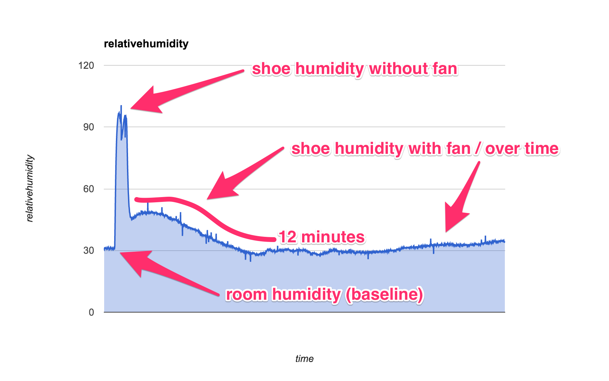

# Lab Notebook

## Overview

The Lab Notebook is used to record notes from experiments and changes to the project.

## Notes

### 2/28/2016

Initial Problem / Hypothesis
* Problem: "As a eco concious person who doesn't like to waste resources, I don't like that my bootdryer may be wasting electricity by continuing to run after my shoes are dry."
* Hypothesis: "By instrumenting the bootdryer with a humidity sensor, I can reduce the amount electricity needed to dry my shoes by turing off the bootdryer when the shoes are dry, not based on an arbitrary timer."

Started prototype using an Arduino Uno and [humidity sensor](https://www.sparkfun.com/products/9569).  Used http://bildr.org/2012/11/hih4030-arduino/ as reference for wiring.

Initial humidity instrumentation test and baselines:
* 30% realative humidity basement baseline
* 96% realative humidity shoe (post 4 mile run)
* 46% realative humidity shoe w/ bootdryer fan blowing after 30 seconds 5:05pm
* 28% realative humidity shoe at 5:24pm
* 32% realative humidityat shoe 5:37pm
* stopped bootdryer at 5:42pm to check humidity of shoe - is 34%
* started bootdryer again at 5:43pm to check humidity with fan running - is 34%
* stopped bootdryer at 5:44pm to check humidity of room - is 30% 3 ft from shoes, 33% 1 ft from shoes

See [dataset](20160228_humiditydataset.csv) and [graph](20160228_humiditygraph.png).

Remaining Questions?
* object (no humidity) w/ fan blowing it it ?
* graphy humidity over time
  * what's the sweet spot?

